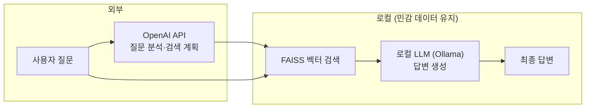

# 포트폴리오: 로컬 AI 기반 Hybrid RAG — 구성 포인트

> **한 줄 요약**  
> 질문 분석만 외부 API에 맡기고, **문서 검색과 답변 생성은 전부 로컬 AI(LLM)로 처리**하는 구조를 설계·구현했습니다.  
> 민감한 내규는 외부로 나가지 않고, **로컬에서만** 해석·생성됩니다.

---

## 1. 왜 로컬 AI를 쓰는가

| 구분 | 외부 API만 사용할 때 | 이 프로젝트 (로컬 AI 활용) |
|------|----------------------|-----------------------------|
| **민감 문서** | 답변 생성 시 문서가 외부 서버로 전송될 수 있음 | **문서는 로컬에만 존재** → 검색·답변 모두 로컬에서 처리 |
| **비용·의존성** | 토큰당 비용, API 장애 시 서비스 중단 | **답변 생성은 로컬 리소스**로 처리 (Ollama) |
| **커스터마이징** | 모델·프롬프트 제어에 한계 | **로컬 LLM·프롬프트**를 직접 조정 가능 (환각 억제, 한국어만 사용 등) |

→ **“로컬 AI를 사용해서 구성했다”**는, 위와 같은 **설계 선택**을 의미합니다.

---

## 2. 아키텍처 — 로컬 AI가 들어가는 위치

**흐름 요약**

1. **외부**: 사용자 질문만 → OpenAI API → “무엇을 검색할지” 계획(JSON) 생성  
2. **로컬**: 계획 + **내부 문서(벡터 DB)** → FAISS 검색  
3. **로컬**: 검색 결과 + 질문 → **로컬 LLM(Ollama)** → 답변 생성  
4. **로컬**: 생성된 답변만 사용자에게 노출  

→ **로컬 AI**는 “검색된 문서를 읽고, 그걸로 답을 만드는” 단계를 전담합니다.

---

## 3. 로컬 AI 연동 상세 (구현 포인트)

### 3.1 사용 스택

- **실행 환경**: 로컬 PC (Ollama 설치)
- **모델**: Ollama 기반 **qwen2.5:3b / qwen2.5:7b** (환경 변수로 지정)
- **연동 방식**: HTTP API (`httpx` → `POST /api/generate`), 스트리밍 미사용

### 3.2 로컬 AI에 넘기는 것

- **입력**: 사용자 질문 + 검색 계획(의도, 초점) + **검색된 문서 텍스트(관련도 순)**
- **제어**:  
  - `temperature` (기본 0.25) → 환각·돈 얘기 등 불필요 확장 억제  
  - `num_predict` → 생성 길이 제한  
  - 프롬프트에 “질문에서 묻지 않은 금액·한도는 쓰지 말 것” 등 **로컬 AI용 규칙** 명시

### 3.3 로컬 AI가 하지 않는 것

- **문서 수집·검색**: FAISS + SentenceTransformers (로컬)
- **질문 의도 분석·검색 계획**: OpenAI API (외부)  
→ **로컬 AI는 “검색 결과 + 질문”만 보고 답변 생성**에만 쓰입니다.

### 3.4 UI에서 보여주는 “로컬 AI 사용”

- Step 3 제목: **「AI 답변 생성 (로컬 LLM)」**
- 답변 상단: **「[Ollama - qwen2.5:7b]」** 등 **사용 중인 로컬 모델명** 표시
- **추론 소요 시간** 표시 → “로컬에서 돌아가는 구간”을 수치로 강조

→ 시연 시 **“여기서 로컬 AI가 돌고 있다”**를 명시적으로 보여줄 수 있습니다.

---

## 4. 포트폴리오로 보여주는 방식 제안

### A. 문서로 강조 (로컬 AI 설계·구현)

- **이 문서(`docs/PORTFOLIO.md`)** 를 그대로 포트폴리오용 1~2페이지 요약으로 사용  
- 또는 이 내용을 **발표 슬라이드 3~5장**으로 옮기기  
  - 1장: 한 줄 요약 + “로컬 AI를 써서 구성했다”  
  - 2장: 아키텍처 다이어그램 (Mermaid 또는 그림)  
  - 3장: “로컬 AI 연동 상세” 요약 (위 3.1~3.4)  
  - 4장: 시연 링크 또는 영상  
  - 5장: 기술 스택·배운 점  

→ **로컬 AI**가 “사용 시연만”이 아니라 **설계·기술 선택·구현 포인트**로 드러납니다.

### B. 시연으로 강조 (실행 환경이 있을 때)

- **로컬 실행** 시:  
  - Ollama 실행 → 앱에서 질문 입력 → Step 3에서 **「[Ollama - qwen2.5:7b]」 + 추론 시간**이 보이도록 시연  
- **영상으로 남길 때**:  
  - 위 화면을 캡처해 “이 답변은 **로컬 PC에서 돌린 Ollama**가 생성한 것”이라고 자막/음성으로 설명  

→ “로컬 AI를 사용해서 구성했다”를 **동작으로** 보여줄 수 있습니다.

### C. 저장소에서 강조

- **README.md** 상단이나 “아키텍처” 섹션에  
  - “**답변 생성은 로컬 LLM(Ollama)으로 동작**” 문구 추가  
  - `docs/PORTFOLIO.md` 링크로 “**로컬 AI 강조 포트폴리오 요약**” 연결  

→ GitHub 등만 봐도 **로컬 AI**가 강조된 구성이라는 인상을 줄 수 있습니다.

---

## 5. 요약

- **“로컬 AI를 사용해서 구성했다”**를 강조하려면:  
  - **문서**: 아키텍처, “로컬 AI 연동 상세”, 보안·데이터 흐름을 한곳에 정리 (이 문서 활용)  
  - **시연**: 로컬 실행 + Step 3 화면(모델명·추론 시간)을 보여주거나, 그 부분을 짧은 영상으로 캡처  
- **사용 시연만**이 아니라 **“왜 로컬 AI인가 → 어디에 쓰였는가 → 어떻게 붙였는가”**를 같이 보여주는 구성을 추천합니다.
